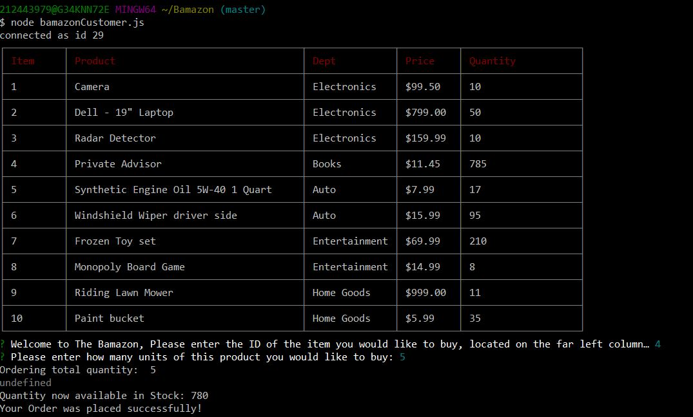
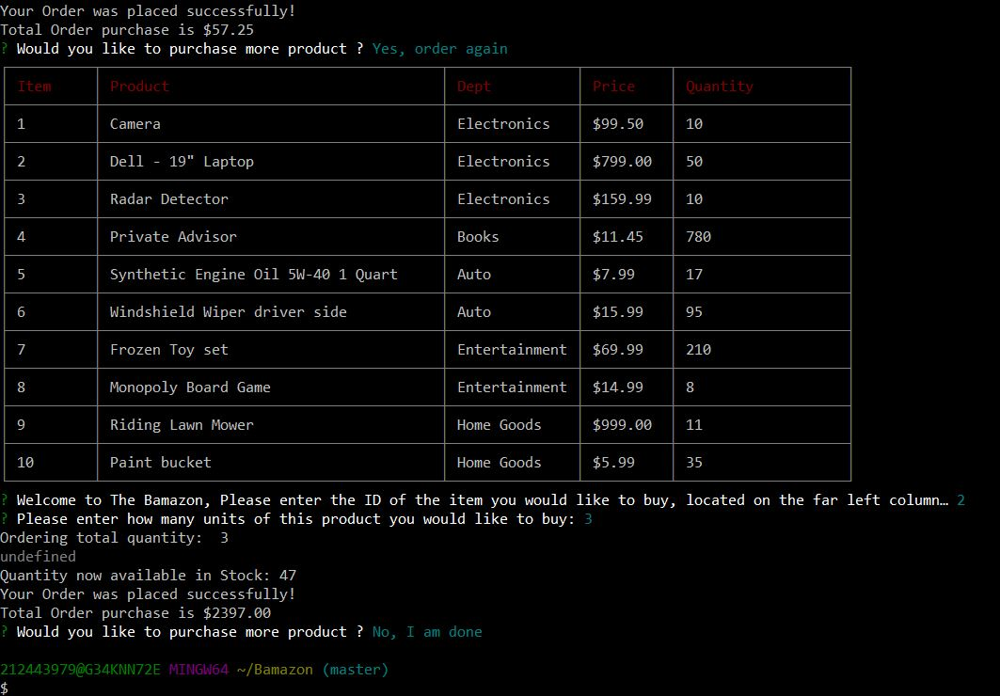

# Bamazon

# **The Bamazon Node store**

### **Amazon-Like store Front app that will take in orders from customers, complete their total and deplete stock from the store's inventory. **

**1. Once bamazonCustomer.js is run, customer is presented with the inventory for a few seconds and then prompted for purchase item ID. Once Id is entered, a second prompt for quantity is presented, once an ineger input is given, the item is searched for in teh DB for availablity. If available, customer is provided total order, available in stock and total price.**

**2.Then a prompt for possible second purchase, if not interested, the arrow key can be used to select "NO", and exit the store.**

